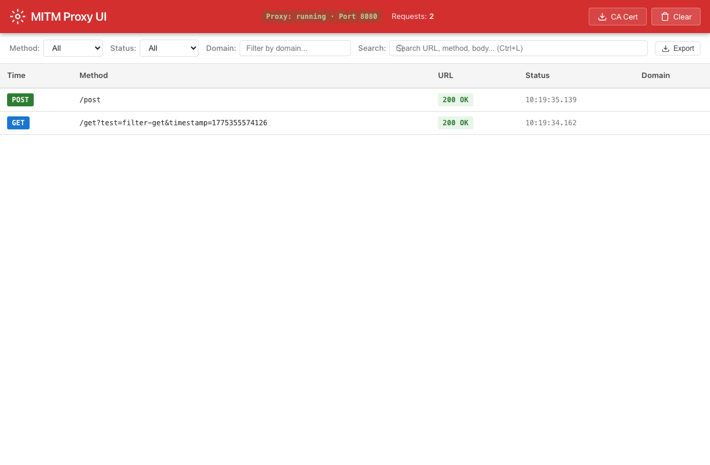

# http-mitm-proxy-ui

A self-contained Node.js package that bundles `http-mitm-proxy` with a modern web-based UI for inspecting HTTP/HTTPS traffic in real time.



## Features

- **Real-time Traffic Inspection**: Live stream of HTTP/HTTPS requests and responses with WebSocket updates
- **Complete Request/Response Details**: Headers, bodies, cookies, query parameters with syntax highlighting
- **Advanced Filtering & Search**: Filter by domain, method, status code, content type with full-text search
- **Auto-generated API Spec**: Automatically generate OpenAPI/Swagger specifications from intercepted traffic
- **Export Data**: Export traffic as JSON or CSV for offline analysis and sharing
- **HTTPS Interception**: Auto-generates and manages SSL certificates with easy CA download
- **Standalone CLI**: Single command to start both proxy and UI with configurable options
- **REST API**: Programmatic access to traffic data and configuration
- **Material Design UI**: Clean, responsive interface with red/black on white theme

## Guides

- 📖 **[User Guide](docs/guides/USER-GUIDE.md)** — Complete documentation with screenshots
- 🔍 **[Qwen Code Use Cases](docs/guides/use-cases-qwen-code.md)** — Inspect Qwen Code API traffic with examples

## Installation

```bash
npm install http-mitm-proxy-ui
```

## Usage

### CLI Usage

Start with default ports (proxy: 8080, UI: 3000):

```bash
npx http-mitm-proxy-ui
```

Custom configuration:

```bash
http-mitm-proxy-ui --proxy-port 9090 --ui-port 4000 --ssl-ca-dir ./my-certs
```

Available options:
- `-p, --proxy-port <port>`: MITM proxy server port (default: 8080)
- `-u, --ui-port <port>`: Web UI server port (default: 3000)
- `-H, --headless`: Run in proxy-only mode (no UI)
- `-c, --config <path>`: Path to JSON config file
- `--ssl-ca-dir <path>`: Directory for SSL CA certificates
- `--ca-cert <path>`: Path to custom CA certificate file (.pem)
- `--ca-key <path>`: Path to custom CA private key file (.pem)
- `--max-requests <count>`: Max requests to keep in memory (default: 1000)
- `-h, --help`: Display help

### Using Custom CA Certificates

If you already have a CA certificate and key (e.g., from a corporate PKI or a previous proxy setup), you can use them instead of auto-generating:

```bash
http-mitm-proxy-ui --ca-cert /path/to/ca.pem --ca-key /path/to/ca.key
```

Both `--ca-cert` and `--ca-key` must be provided together. The files are copied into the `--ssl-ca-dir` (default: `~/.http-mitm-proxy-ui/ca`) in the format expected by the proxy. When omitted, a new CA is auto-generated on first run.

You can also set these in a JSON config file:

```json
{
  "caCertPath": "/path/to/ca.pem",
  "caKeyPath": "/path/to/ca.key"
}
```

### Programmatic Usage

```typescript
import { createProxyUI } from 'http-mitm-proxy-ui';

const proxy = createProxyUI({
  proxyPort: 8080,
  uiPort: 3000,
});

proxy.on('request', (req) => {
  console.log('Request:', req.method, req.url);
});

proxy.on('response', (req) => {
  console.log('Response:', req.response?.statusCode);
});

await proxy.start();
```

## Architecture

```
┌─────────────────────────────────────────────┐
│           http-mitm-proxy-ui                │
├──────────────────┬──────────────────────────┤
│  MITM Proxy      │  Web UI Server           │
│  (http-mitm-     │  (Express + Vue 3)       │
│   proxy core)    │                          │
│  - Intercept     │  - WebSocket for         │
│    HTTP/HTTPS    │    real-time updates     │
│  - Capture &     │  - REST API for          │
│    emit events   │    history/query         │
│                  │  - Static file serving   │
└────────┬─────────┴────────────┬─────────────┘
         │                      │
         ▼                      ▼
    Network Traffic        Browser (localhost:3000)
    (localhost:8080)
```

## API Endpoints

When the UI server is running (not headless):

- `GET /api/health` - Health check
- `GET /api/requests` - List requests with filtering/pagination
- `GET /api/requests/:id` - Get specific request details
- `DELETE /api/requests` - Clear request history
- `GET /api/config` - Get current configuration
- `GET /api/ca-cert` - Download CA certificate for trust installation
- `GET /*` - Serves the Vue SPA (all other routes)

## WebSocket Events

Connect to `ws://localhost:3000/ws` for real-time updates:

- `{ type: 'init', data: [...] }` - Initial state on connection
- `{ type: 'request', data: RequestRecord }` - New request captured
- `{ type: 'response', data: RequestRecord }` - Response received
- `{ type: 'error', data: { message: string } }` - Error occurred
- `{ type: 'clear', data: {} }` - History cleared

## Configuration

Create a `proxy-config.json` file:

```json
{
  "proxyPort": 8080,
  "uiPort": 3000,
  "sslCaDir": "./certs",
  "maxRequests": 1000,
  "headless": false
}
```

Then start with: `http-mitm-proxy-ui --config ./proxy-config.json`

## Development

```bash
# Install dependencies
npm install

# Build the package
npm run build

# Start in development mode (watches for changes)
npm run dev

# Run tests
npm test
```

## Use Cases

### Debugging API Calls
1. Start the proxy: `http-mitm-proxy-ui`
2. Configure your application to use `localhost:8080` as HTTP/HTTPS proxy
3. Visit `http://localhost:3000` to see live traffic
4. Use filtering to isolate specific endpoints
5. Inspect full request/response details including headers, bodies, and timing

### Mobile App Testing
1. Start the proxy on your development machine
2. Configure your mobile device to use your machine's IP:8080 as proxy
3. Install the CA certificate on your device (download from `http://YOUR_IP:3000/api/ca-cert`)
4. Inspect mobile app network calls with full visibility

### Security Testing
1. Capture and inspect all traffic for unexpected requests or data leaks
2. Verify authorization headers and sensitive data in transit
3. Export captured traffic as JSON or CSV for team analysis

### API Documentation
1. Capture traffic while navigating your application or running tests
2. Switch to the Swagger Spec tab to view the auto-generated OpenAPI documentation
3. Update the spec from live traffic as new endpoints are discovered

## Configuring Existing Applications to Use the Proxy

The primary purpose of this tool is to **intercept and inspect traffic from existing applications without modifying their code**. You do this by setting proxy environment variables or command-line flags.

### Step 1: Install the CA Certificate (for HTTPS)

Before intercepting HTTPS traffic, you must trust the proxy's CA certificate:

```bash
# Start the proxy once to generate the CA
http-mitm-proxy-ui

# Download the CA certificate
curl http://localhost:3000/api/ca-cert -o http-mitm-proxy-ca.pem

# On macOS, add to Keychain and trust it:
security add-trusted-cert -d -r trustRoot -k ~/Library/Keychains/login.keychain http-mitm-proxy-ca.pem

# On Linux (Debian/Ubuntu):
sudo cp http-mitm-proxy-ca.pem /usr/local/share/ca-certificates/
sudo update-ca-certificates
```

### Step 2: Configure Your Application

#### Node.js Applications

Node.js respects standard proxy environment variables. Start your app with:

```bash
# For HTTP and HTTPS traffic
HTTP_PROXY=http://localhost:8080 HTTPS_PROXY=http://localhost:8080 node your-app.js

# Or if using npm scripts
HTTP_PROXY=http://localhost:8080 HTTPS_PROXY=http://localhost:8080 npm start

# For apps that use the `proxy` env var (some libraries)
proxy=http://localhost:8080 node your-app.js
```

**Note**: Some HTTP clients in Node.js (like `axios`, `node-fetch`) don't automatically respect env vars. For those, you may need to pass an `agent` with proxy support, or use `global-agent`:

```bash
# Force all Node.js HTTP clients through the proxy
npx global-agent bootstrap -- node your-app.js
```

#### curl / wget

```bash
# curl with proxy
curl --proxy http://localhost:8080 https://api.example.com/data

# curl with explicit HTTPS proxy (for HTTPS targets)
curl --proxy http://localhost:8080 --proxy-insecure https://api.example.com/data

# wget with proxy
export http_proxy=http://localhost:8080
export https_proxy=http://localhost:8080
wget https://api.example.com/data
```

#### Java Applications

Java uses system properties for proxy configuration. Pass them via `-D` flags:

```bash
# Basic HTTP proxy
java -Dhttp.proxyHost=localhost -Dhttp.proxyPort=8080 \
     -Dhttps.proxyHost=localhost -Dhttps.proxyPort=8080 \
     -jar your-app.jar

# For Spring Boot apps
java -Dhttp.proxyHost=localhost -Dhttp.proxyPort=8080 \
     -Dhttps.proxyHost=localhost -Dhttps.proxyPort=8080 \
     -Dhttp.nonProxyHosts="localhost|127.0.0.1" \
     -jar your-app.jar

# For Maven-based apps
mvn -Dhttp.proxyHost=localhost -Dhttp.proxyPort=8080 \
    -Dhttps.proxyHost=localhost -Dhttps.proxyPort=8080 \
    spring-boot:run

# For Gradle-based apps
gradle -Dorg.gradle.jvmargs="-Dhttp.proxyHost=localhost -Dhttp.proxyPort=8080 -Dhttps.proxyHost=localhost -Dhttps.proxyPort=8080" bootRun
```

**Note**: Java's default HTTP client may not intercept all traffic (e.g., OkHttp, Apache HttpClient may need separate proxy config). See [Java-specific notes below](#java-specific-http-clients).

#### Python Applications

```bash
# Standard library (urllib, requests with env var support)
HTTP_PROXY=http://localhost:8080 HTTPS_PROXY=http://localhost:8080 python your-app.py

# For pip itself (debugging package installs)
HTTP_PROXY=http://localhost:8080 HTTPS_PROXY=http://localhost:8080 pip install requests
```

#### Docker Containers

```bash
# Pass proxy env vars to container
docker run -e HTTP_PROXY=http://host.docker.internal:8080 \
           -e HTTPS_PROXY=http://host.docker.internal:8080 \
           your-image

# Or in docker-compose.yml:
# services:
#   app:
#     environment:
#       - HTTP_PROXY=http://host.docker.internal:8080
#       - HTTPS_PROXY=http://host.docker.internal:8080
```

**Note**: On macOS/Windows, use `host.docker.internal` instead of `localhost` to reach the host machine from inside a container.

#### React / Angular / Vue Dev Servers

```bash
# React (Create React App)
HTTP_PROXY=http://localhost:8080 npm start

# Angular
HTTP_PROXY=http://localhost:8080 ng serve

# Vite
HTTP_PROXY=http://localhost:8080 npm run dev
```

### Java-Specific HTTP Clients

Some Java HTTP libraries don't respect the `-D` system properties above. Configure them individually:

**OkHttp:**
```java
Proxy proxy = new Proxy(Proxy.Type.HTTP, new InetSocketAddress("localhost", 8080));
OkHttpClient client = new OkHttpClient.Builder()
    .proxy(proxy)
    .build();
```

**Apache HttpClient:**
```java
HttpHost proxy = new HttpHost("localhost", 8080, "http");
RequestConfig config = RequestConfig.custom()
    .setProxy(proxy)
    .build();
CloseableHttpClient client = HttpClients.custom()
    .setDefaultRequestConfig(config)
    .build();
```

**Java 11+ HttpClient:**
```java
HttpClient client = HttpClient.newBuilder()
    .proxy(ProxySelector.of(new InetSocketAddress("localhost", 8080)))
    .build();
```

## License

ISC

## Author & Credits

- **Dung Tran** ([dungviettran89](https://github.com/dungviettran89))
- Built with [OpenClaw](https://github.com/dungviettran89/openclaw) — an AI agent framework for autonomous development
- Code written with assistance from [Qwen Coder](https://qwenlm.github.io/) — an AI coding assistant
