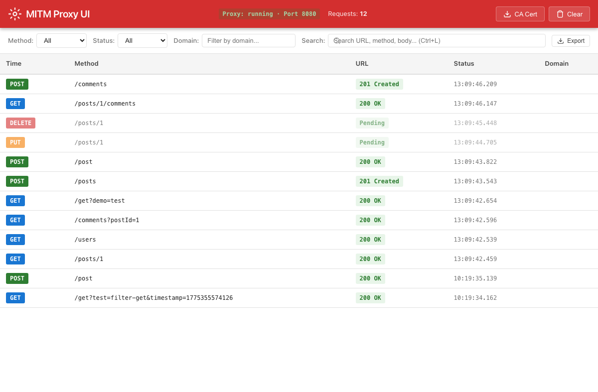
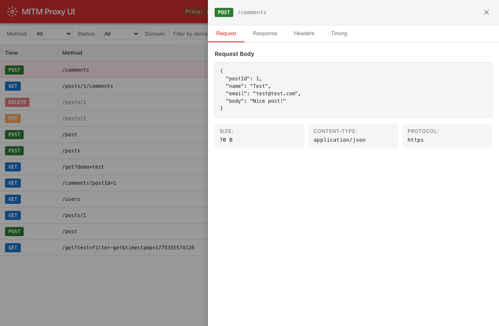
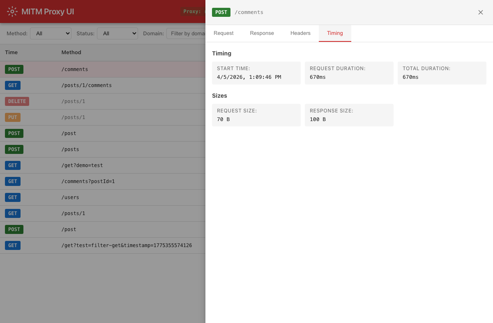
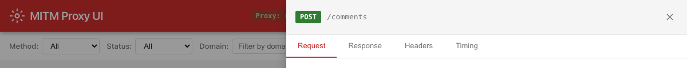
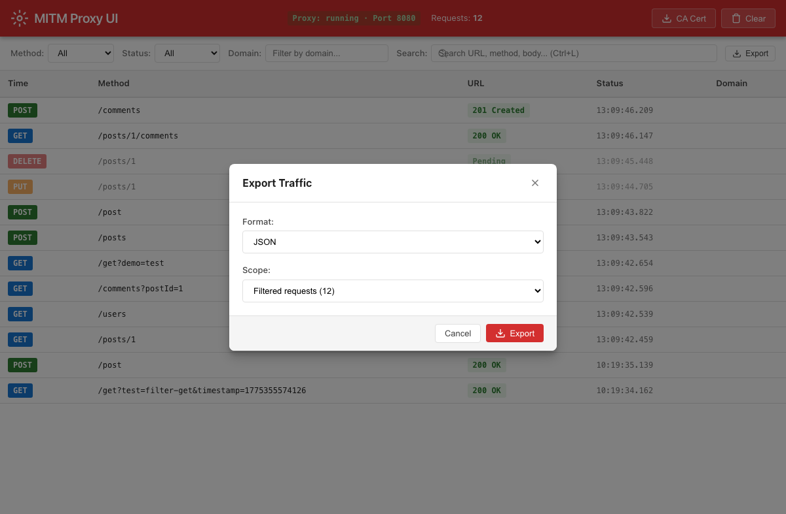

# HTTP MITM Proxy UI — User Guide

A real-time HTTP/HTTPS traffic inspector with a modern web-based UI. Intercept, inspect, filter, and export network traffic from any application — no code changes required.

---

## Table of Contents

1. [Getting Started](#getting-started)
2. [UI Overview](#ui-overview)
3. [Inspecting Requests](#inspecting-requests)
4. [Filtering & Searching](#filtering--searching)
5. [Viewing Request & Response Details](#viewing-request--response-details)
6. [Proxy Configuration](#proxy-configuration)
7. [Exporting Data](#exporting-data)
8. [Tips & Troubleshooting](#tips--troubleshooting)

---

## Getting Started

### Installation

Install the package globally via npm:

```bash
npm install -g http-mitm-proxy-ui
```

Or run it directly without installing:

```bash
npx http-mitm-proxy-ui
```

### Starting the Proxy

Start with default settings (proxy on port 8080, UI on port 3000):

```bash
npx http-mitm-proxy-ui
```

Customize ports and settings:

```bash
npx http-mitm-proxy-ui --proxy-port 9090 --ui-port 4000
```

| Flag | Description | Default |
|---|---|---|
| `--proxy-port <port>` | MITM proxy server port | 8080 |
| `--ui-port <port>` | Web UI server port | 3000 |
| `--headless` | Run proxy only (no UI) | false |
| `--ssl-ca-dir <path>` | Directory for SSL CA certificates | `~/.http-mitm-proxy-ui/ca` |
| `--ca-cert <path>` | Path to custom CA certificate file (.pem) | — |
| `--ca-key <path>` | Path to custom CA private key file (.pem) | — |
| `--max-requests <count>` | Max requests to keep in memory | 1000 |
| `--no-modification` | Disable request/response modification | false |
| `--config <path>` | Path to a JSON config file | — |

### Installing the CA Certificate

To intercept HTTPS traffic, you must trust the proxy's CA certificate.

**macOS:**

```bash
# Download the CA certificate
curl http://localhost:3000/api/ca-cert -o http-mitm-proxy-ca.pem

# Add to Keychain and trust it
security add-trusted-cert -d -r trustRoot -k ~/Library/Keychains/login.keychain http-mitm-proxy-ca.pem
```

**Linux (Debian/Ubuntu):**

```bash
curl http://localhost:3000/api/ca-cert -o http-mitm-proxy-ca.pem
sudo cp http-mitm-proxy-ca.pem /usr/local/share/ca-certificates/
sudo update-ca-certificates
```

**Windows:**
1. Download from `http://localhost:3000/api/ca-cert`
2. Double-click the `.pem` file
3. Click **Install Certificate** → **Local Machine** → **Place all certificates in the following store** → **Trusted Root Certification Authorities**

### Using a Custom CA Certificate

If you already have a CA certificate and key (e.g., from a corporate PKI or a previous proxy setup), you can use them instead of the auto-generated certificate:

```bash
npx http-mitm-proxy-ui --ca-cert /path/to/my-ca.pem --ca-key /path/to/my-ca.key
```

Both `--ca-cert` and `--ca-key` must be provided together. The files are copied into the `--ssl-ca-dir` (default: `~/.http-mitm-proxy-ui/ca`) in the format expected by the proxy. When omitted, a new CA is auto-generated on first run.

You can also set these in a JSON config file:

```json
{
  "caCertPath": "/path/to/my-ca.pem",
  "caKeyPath": "/path/to/my-ca.key"
}
```

This is useful when:
- Your organization requires a specific CA certificate for compliance
- You want to reuse the same CA across multiple machines or sessions
- You've already trusted a CA certificate on your devices and don't want to re-trust a new one

### Configuring Applications

Route your application's traffic through the proxy by setting environment variables:

```bash
# Node.js
HTTP_PROXY=http://localhost:8080 HTTPS_PROXY=http://localhost:8080 node app.js

# Python
HTTP_PROXY=http://localhost:8080 HTTPS_PROXY=http://localhost:8080 python app.py

# curl
curl --proxy http://localhost:8080 https://api.example.com/data

# Java
java -Dhttp.proxyHost=localhost -Dhttp.proxyPort=8080 \
     -Dhttps.proxyHost=localhost -Dhttps.proxyPort=8080 \
     -jar app.jar
```

### Accessing the UI

Open your browser and navigate to:

```
http://localhost:3000
```

All intercepted traffic appears in real time.

---

## UI Overview



The main dashboard provides a live view of all intercepted HTTP/HTTPS traffic. The interface is organized into three main areas:

### Header Bar
- **Logo & Title** — Application identifier
- **Proxy Status** — Shows whether the proxy is `running`, `stopped`, or `unknown`, along with the active proxy port
- **Request Counter** — Total number of captured requests in the current session
- **CA Cert Button** — Download the CA certificate for trust installation
- **Clear Button** — Clear all captured request history

### Filter Bar
Located directly below the header. Provides method, status, domain, and full-text search filters, plus an export button. See [Filtering & Searching](#filtering--searching) for details.

### Request Table
The main content area displays all captured requests in a sortable table with the following columns:

| Column | Description |
|---|---|
| **Time** | Timestamp with millisecond precision (sortable) |
| **Method** | HTTP method (GET, POST, PUT, DELETE, PATCH, etc.) with color-coded badges |
| **URL** | Request path and query string |
| **Status** | HTTP response status code with color-coded badges (green for 2xx, blue for 3xx, orange for 4xx, red for 5xx) |
| **Domain** | Target hostname |

**Color-coded method badges:**
- 🔵 **GET** — Blue
- 🟢 **POST** — Green
- 🟠 **PUT** — Orange
- 🔴 **DELETE** — Red
- 🟣 **PATCH** — Purple

---

## Inspecting Requests

Click any row in the request table to open the **Request Detail Panel**. The panel slides in from the right side of the screen, overlaying the main table.



The detail panel contains four tabs for comprehensive inspection:

### Request Tab
Shows the outgoing request details:
- **Request Body** — Pretty-printed if JSON, otherwise raw text
- **Content Type** — MIME type of the request body
- **Body Size** — Size in bytes
- **Protocol** — HTTP or HTTPS

### Response Tab
Shows the server's response:
- **Response Body** — Pretty-printed if JSON, otherwise raw text
- **Status Code** — HTTP status code with badge
- **Content Type** — MIME type of the response
- **Body Size** — Size in bytes

### Headers Tab
Displays both request and response headers in labeled tables:

| Request Headers | Response Headers |
|---|---|
| `host`, `user-agent`, `accept`, `content-type`, etc. | `date`, `server`, `content-type`, `content-length`, `access-control-*`, etc. |

### Timing Tab
Performance metrics for the request lifecycle:
- **Start Time** — When the request was initiated
- **Request Duration** — Time to send the request
- **Response Time** — Time to first byte
- **Total Duration** — End-to-end latency
- **Request Size** — Total bytes sent
- **Response Size** — Total bytes received

**Close the detail panel** by clicking the ✕ button, clicking the overlay backdrop, or pressing `Escape`.

---

## Filtering & Searching


The filter bar provides multiple ways to narrow down captured traffic.

### Method Filter
Dropdown to filter by HTTP method:
- All, GET, POST, PUT, DELETE, PATCH, HEAD, OPTIONS

### Status Filter
Dropdown to filter by response status code range:
- All, 2xx (Success), 3xx (Redirect), 4xx (Client Error), 5xx (Server Error)

### Domain Filter
Text input to filter by hostname. Type a domain name (e.g., `jsonplaceholder.typicode.com`) to show only requests to that host.

### Search
Full-text search across:
- Request URL
- HTTP method
- Request body
- Response body

Press `Ctrl+L` (or `Cmd+L` on macOS) to quickly focus the search field.

### Clear Filters
When any filter is active, a **Clear Filters** button appears. Click it (or press `Ctrl+K` / `Cmd+K`) to reset all filters.

### Column Sorting
Click any column header (**Time**, **Method**, **URL**, **Status**) to sort the table by that column. Click again to toggle ascending/descending order.

---

## Viewing Request & Response Details

### Response Body View



The Response tab displays the full response body with automatic formatting:

- **JSON responses** are pretty-printed with syntax-friendly formatting for readability
- **Text responses** (HTML, XML, plain text) are displayed as-is
- **Binary responses** show size and content-type information

Use the response body view to:
- Verify API response payloads and data structures
- Debug malformed JSON or unexpected data formats
- Inspect error response bodies for debugging information
- Compare request/response data pairs

### Keyboard Shortcuts

| Shortcut | Action |
|---|---|
| `Ctrl+L` / `Cmd+L` | Focus search field |
| `Ctrl+K` / `Cmd+K` | Clear all filters |
| `Ctrl+E` / `Cmd+E` | Open export dialog |
| `Escape` | Close detail panel or export dialog |

---

## Proxy Configuration



The header bar displays the current proxy status and configuration:

- **Proxy Status** — `running` (green, with animated pulse indicator), `stopped`, or `unknown`
- **Port** — The active proxy port number (default: 8080)
- **Request Count** — Total number of requests captured in the current session

### Downloading the CA Certificate
Click the **CA Cert** button in the header to download the proxy's CA certificate. Install it in your system's trust store to enable HTTPS interception.

### Clearing History
Click the **Clear** button to remove all captured requests from the UI and the underlying database. This is useful when you want a clean slate for a new debugging session.

---

## Exporting Data



Export captured traffic for offline analysis, sharing with team members, or archiving.

### Opening the Export Dialog
- Click the **Export** button in the filter bar
- Or press `Ctrl+E` / `Cmd+E`

### Export Options

**Format:**
- **JSON** — Full request/response data with headers, bodies, and timing information. Ideal for programmatic analysis or sharing with developers.
- **CSV** — Tabular format with key fields (method, URL, status, time, domain). Best for spreadsheets and reporting.

**Scope:**
- **Filtered Requests** — Export only the requests matching your current filter criteria (shown with count)
- **All Requests** — Export every captured request regardless of active filters

### Downloaded File
The export generates a downloadable file with a timestamp in the name:
- JSON: `proxy-traffic-YYYY-MM-DDTHH-MM-SS.json`
- CSV: `proxy-traffic-YYYY-MM-DDTHH-MM-SS.csv`

A progress bar is displayed during export for large datasets.

---

## Tips & Troubleshooting

### Tips

1. **Start with a clean slate** — Click **Clear** before beginning a new debugging session to avoid noise from previous traffic.

2. **Use domain filtering for focused debugging** — If your app talks to multiple APIs, filter by the specific domain you're debugging to reduce noise.

3. **Sort by Time for chronological analysis** — The default sort is newest-first. Click the **Time** column header to toggle between newest-first and oldest-first.

4. **Export filtered results** — Apply your filters first, then export only the relevant subset of traffic instead of everything.

5. **Use the REST API for automation** — The backend exposes a REST API at `http://localhost:3000/api/` for programmatic access to traffic data:
   - `GET /api/requests` — List all requests (supports query params for filtering)
   - `GET /api/requests/:id` — Get a specific request
   - `DELETE /api/requests` — Clear history
   - `GET /api/health` — Health check
   - `GET /api/config` — Current configuration

6. **WebSocket for real-time integration** — Connect to `ws://localhost:3000/ws` for real-time stream of incoming requests and responses.

7. **Use config files for repeatable setups** — Save your preferred settings in a JSON file and start with `--config ./my-config.json`.

### Troubleshooting

**No traffic appearing in the UI:**
- Verify your application is actually routing traffic through `localhost:8080`
- Check that `HTTP_PROXY` and `HTTPS_PROXY` environment variables are set correctly
- For Node.js apps using `axios` or `node-fetch`, you may need `global-agent`: `npx global-agent bootstrap -- node app.js`
- Ensure the proxy status shows `running` in the header

**HTTPS requests failing with certificate errors:**
- Install the CA certificate (see [Installing the CA Certificate](#installing-the-ca-certificate))
- On macOS, make sure the certificate is set to "Always Trust" in Keychain Access
- On Docker, use `host.docker.internal:8080` instead of `localhost:8080`

**Requests showing "Pending" status:**
- The response hasn't arrived yet. This is normal for slow or hanging requests
- If it persists, the upstream server may be unreachable

**UI not loading or showing errors:**
- Ensure the server is running: `npx http-mitm-proxy-ui`
- Check that port 3000 is not occupied by another process
- Try clearing the browser cache or using an incognito window

**Memory issues with many requests:**
- Use `--max-requests <count>` to limit how many requests are kept in memory (default: 1000)
- Regularly clear history with the **Clear** button during long debugging sessions

**Proxy port conflict:**
- If port 8080 is already in use, start with a different port: `npx http-mitm-proxy-ui --proxy-port 9090`

---

*HTTP MITM Proxy UI — Built for developers who need to see what their apps are really sending over the wire.*
